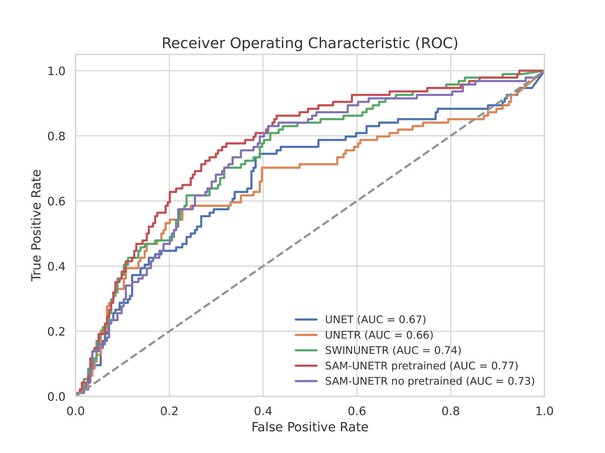
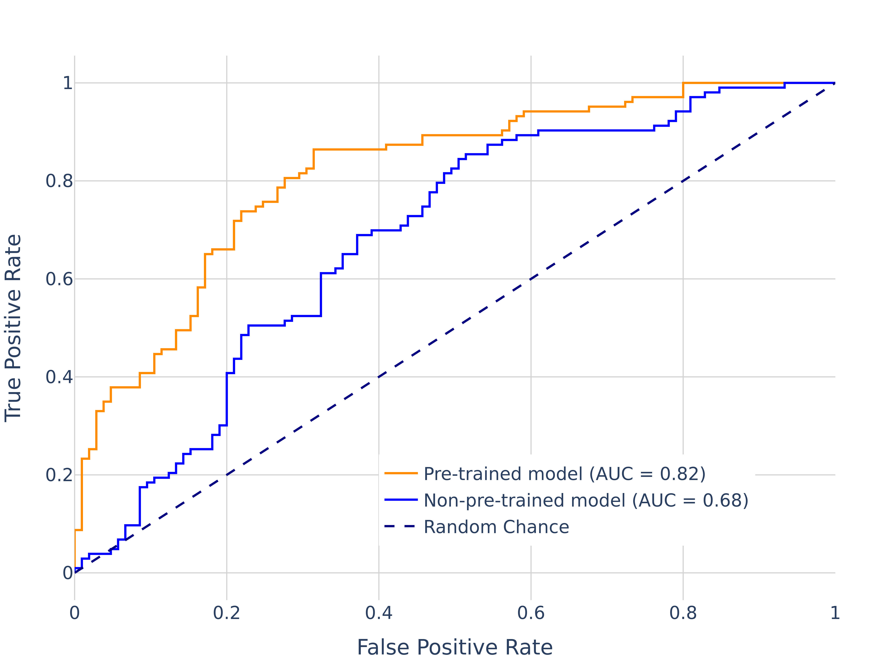

# Prostate Cancer Detection using AI and MRI

This repository contains the code and documentation for the detection of Clinically Significant Prostate Cancer (csPCa) using MRI and advanced AI techniques. This project is part of a thesis work that aims to enhance the accuracy and efficiency of prostate cancer detection through deep learning models.

<p align="center">
  
  
</p>

## Table of Contents

- [Introduction](#introduction)
- [Dataset](#dataset)
- [Models](#models)
- [Methodology](#methodology)
- [Results](#results)
- [Installation](#installation)
- [Usage](#usage)
- [References](#references)


## Introduction

Prostate cancer is a leading cause of cancer-related death among men worldwide. Accurate detection and segmentation of csPCa using MRI are crucial for diagnosis, treatment planning, and monitoring. This project introduces an AI-based models designed to improve the detection of csPCa using MRI.

## Dataset

The datasets used in this project includes [PI-CAI Challenge dataset](https://zenodo.org/records/6624726) [1], and MRI images and clinical data from over 8,000 subjects from the (Banco de Imagen Médica de la Comunidad Valenciana) BIMCV Prostate dataset. The dataset is structured using the Medical Imaging Data Structuring (MIDS) framework to ensure robustness and diversity (https://github.com/BIMCV-CSUSP/dcm2mids).

## Models

### SAM-UNETR (Segmentation)

SAM-UNETR is a novel model for segmenting csPCa regions from MRI images. It integrates a transformer-encoder from the Segment Anything Model (SAM) with a residual-convolution decoder inspired by UNETR, all code for the segmentation experiments can be found in https://github.com/jesusalzate/SAM-UNETR [2].

### 3D EfficientNet-B7 (Classification)

A 3D EfficientNet-B7 model is adapted and trained for classifying csPCa from multiparametric MRI scans. The model leverages transfer learning from the PI-CAI dataset to enhance performance. It was adapted using MONAI 1.2.0

## Methodology

1. **Data Preprocessing:** Image normalization, augmentation, and prostate zone segmentation.
2. **Model Training:** Utilization of advanced deep learning techniques, including Vision Transformers and Transfer Learning.
3. **Model Evaluation:** Benchmarking against other models and applying interpretability techniques such as occlusion sensitivity and guided backpropagation.

## Results

- **Segmentation:** SAM-UNETR achieved a Dice Score of 0.467 and an AUROC of 0.77 for csPCa prediction.
<p align="center">
  
</p>

- **Classification:** The 3D EfficientNet-B7 model achieved an AUC of 0.82 in the validation set.
<p align="center">
  
</p>

### Dependencies

The current release depends on the following Python libraries:

- monai == 1.2.0
- numpy == 1.23.4
- pandas == 2.1.0
- prettytable == 3.9.0
- ptflops == 0.7
- pygad == 3.2.0
- tensorboard == 2.8.0
- torch == 1.12.1
- torchmetrics == 1.1.2
- torchvision == 0.13.1
- tqdm == 4.62.3

## Installation

To set up the project environment and code you can install [BIMCV_AIKit](https://github.com/BIMCV-CSUSP/BIMCV-AIKit):

```bash
git clone https://github.com/BIMCV-CSUSP/BIMCV-AIKit.git
cd BIMCV-AIKit
pip install -e .
```

## Usage

1. **Data Preparation:** Ensure the dataset is available and structured as required, all data preparation and analysis can be found in [Data Structuring](./Data_Structuring/) and [Data Analysis](./Data_Analysis/) folders.
2. **Training:** Run the training scripts provided in the [Classification](./Classification/) directory or follow  [SAM-UNETR](https://github.com/jesusalzate/SAM-UNETR).
3. **Evaluation:** Use the evaluation scripts to assess model performance on the validation set.

## References

[1] A. Saha, J. S. Bosma, J. J. Twilt, B. van Ginneken, A. Bjartell, A. R. Padhani, D. Bonekamp, G. Villeirs, G. Salomon, G. Giannarini, J. Kalpathy-Cramer, J. Barentsz, K. H. Maier-Hein, M. Rusu, O. Rouvière, R. van den Bergh, V. Panebianco, V. Kasivisvanathan, N. A. Obuchowski, D. Yakar, M. Elschot, J. Veltman, J. J. Fütterer, M. de Rooij, H. Huisman, and the PI-CAI consortium. “Artificial Intelligence and Radiologists in Prostate Cancer Detection on MRI (PI-CAI): An International, Paired, Non-Inferiority, Confirmatory Study”. The Lancet Oncology 2024; 25(7): 879-887.

[2] J. A. Alzate-Grisales, A. Mora-Rubio, F. García-García, R. Tabares-Soto and M. De La Iglesia-Vayá, "SAM-UNETR: Clinically Significant Prostate Cancer Segmentation Using Transfer Learning From Large Model," in IEEE Access, vol. 11, pp. 118217-118228, 2023, doi: 10.1109/ACCESS.2023.3326882. keywords: {Image segmentation;Training;Principal component analysis;Transfer learning;Task analysis;Magnetic resonance imaging;Lesions;Artificial intelligence;deep learning;prostate cancer;semantic segmentation},


## Grants and funding
 
Funded by the Spanish Ministry of Economic Affairs and Digital Transformation (Project MIA.2021.M02.0005 TARTAGLIA, from the Recovery, Resilience, and Transformation Plan financed by the European Union through Next Generation EU funds). TARTAGLIA takes place under the R&D Missions in Artificial Intelligence program, which is part of the Spain Digital 2025 Agenda and the Spanish National Artificial Intelligence Strategy.